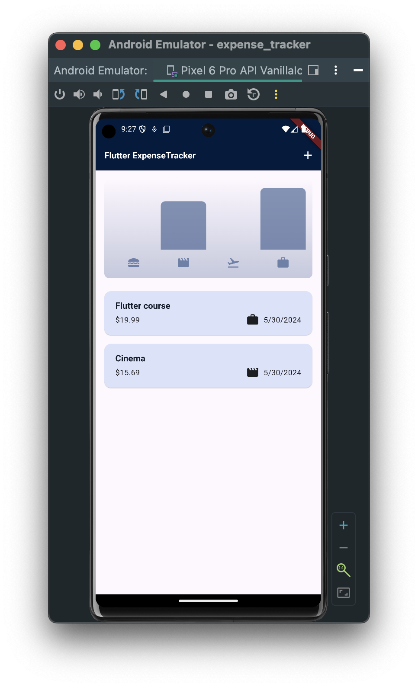
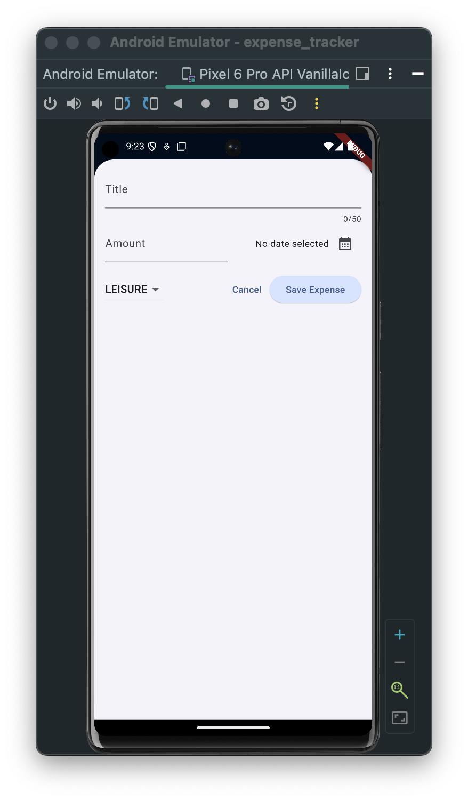
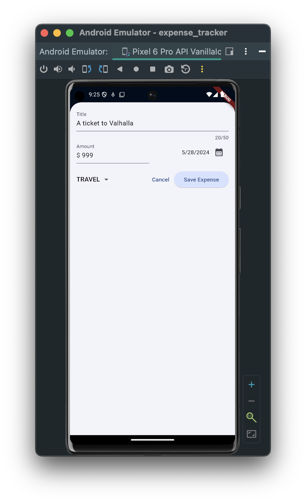
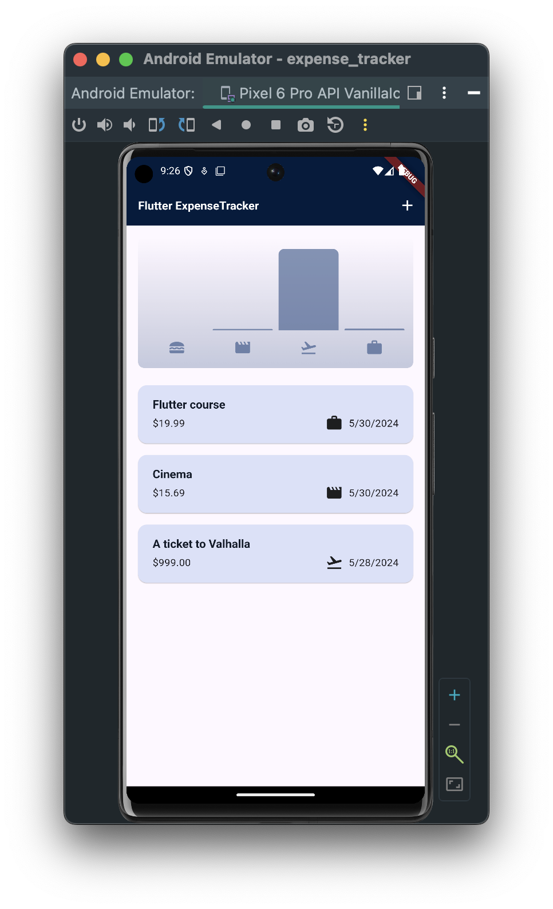
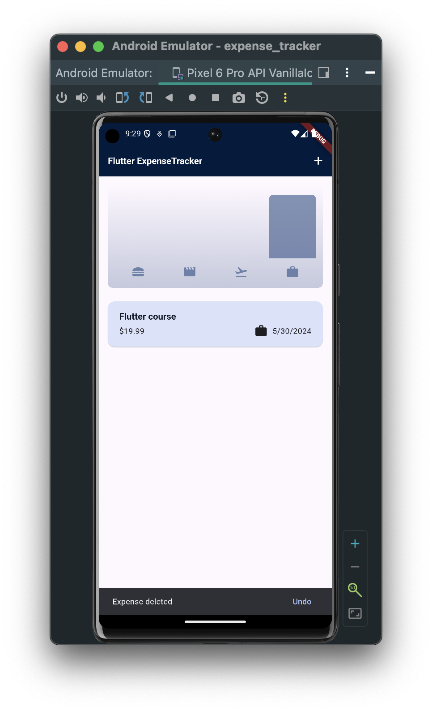
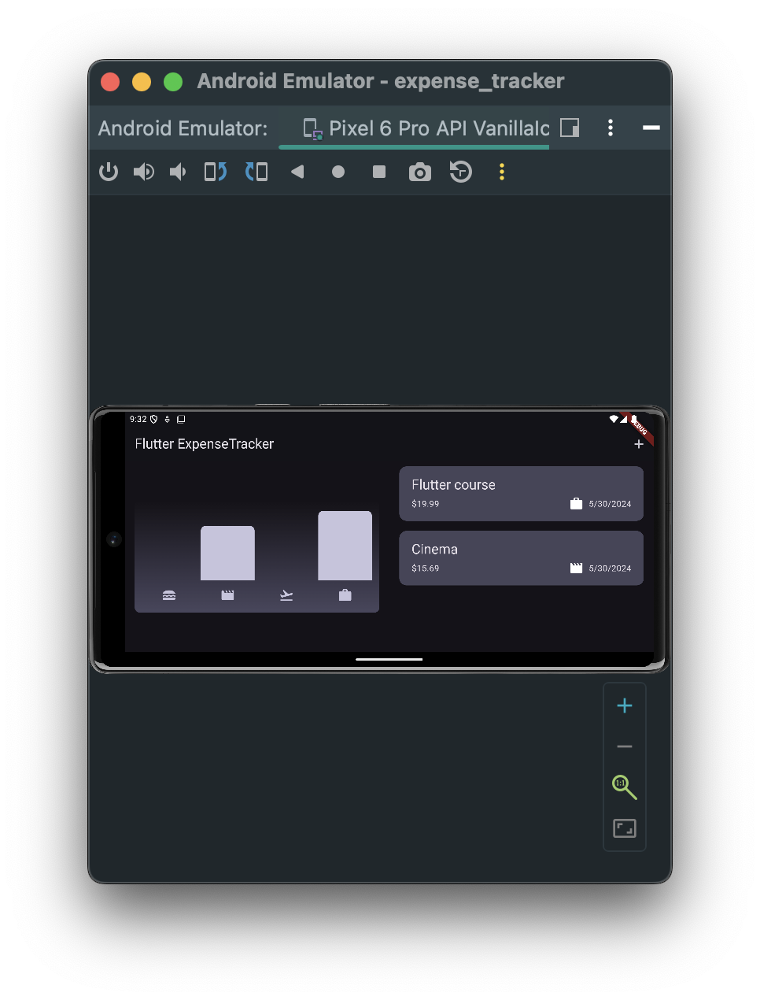
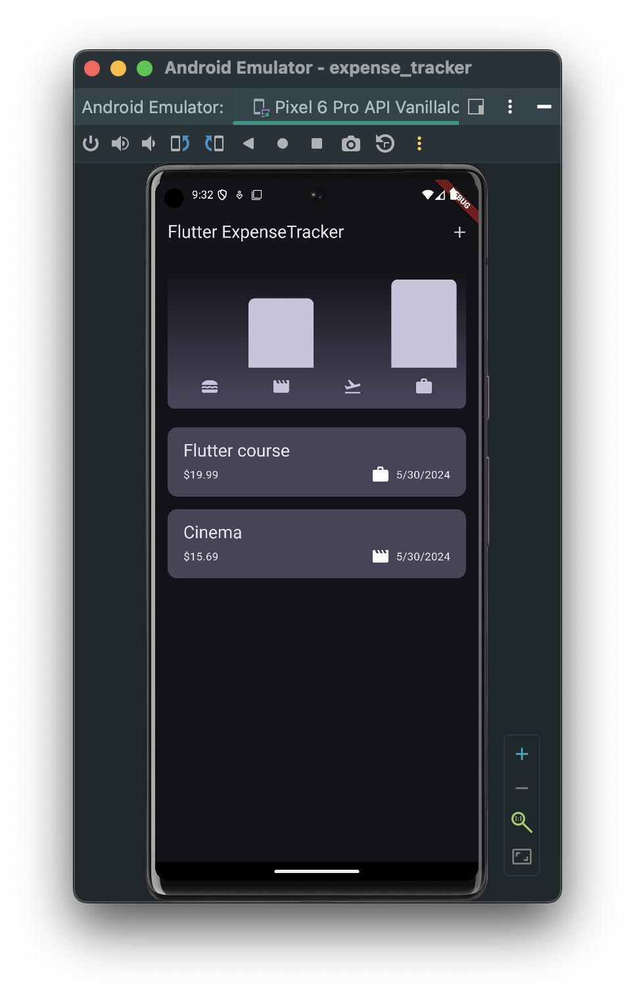

# Expense tracker
The application was developed on a course https://www.udemy.com/course/learn-flutter-dart-to-build-ios-android-apps/

IThe app is designed to keep track of your spending. In it you can select the category of expenses and their date.

 

The project applied color palette shifts when choosing a dark theme. Also, the markup was realized when the device is placed horizontally.

